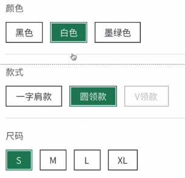

# 微信小程序电商项目

## 安装依赖
```shell
npm install
```

## 构建npm
使用微信小程序工具构建npm。


### 主题和banner

**在本项目中，主题一般都是有封面图的。**banner一般是没有大的封面图的。而是轮播图那种。当然我这里说的也不全。

### 热卖榜单模块

关于项目的 **热卖榜单模块，到底是设置为主题还是banner？**

其实最后两个设置都不是。而是 **主题和banner的集合体。**

这个模块既有类似于 **每周上新主题**的查看更多按钮，也有banner封面图。将每个主题的大图放在一起，抽象为 **一个banner的图。**


## 优惠券
优惠券的设计是比较复杂的。
当然复杂的还是主要在服务端。
在前端，难度主要是**优惠券的核算**。

### 优惠券的类型
- 一般类型有：满减，折扣。
- 优惠券的使用都是有条件的。
- 有的优惠券不是全场通用的，是分品类的。
- 甚至优惠券还可能过期。

**项目越大，优惠券的设计就越难。**


### 优惠券的概念

**优惠券的领取和使用，不是同一个概念。<span style="color:red">不要混为一谈。</span>**


### 优惠券的领取

本项目中：优惠券的领取是通过优惠券活动来进行领取的。

- 活动，肯定都是有开始时间和结束时间的。这个优惠券只能在活动时间内使用。

- 甚至只有活动上线了，这个优惠券才能使用。

- 而且这个优惠券领取了，也不一定就可以在任何地方都使用。


#### 数据的保存

保存数据，在小程序里面有很多种方案。

- 当前页面的data里面
- 缓存
- 全局app
- 类的对象

前三种方式保存数据，一般都只能保存一份数据。而且保存在缓存中还比较难以清除，。

我们知道，类是可以保存数据的。但是类不能保存数据的状态。

类的对象，本身就具有保存数据的功能。

而我们使用类的对象，是既可以保存数据，也可以保存状态的。


## Spu / Sku的概念

> **SPU : 标准化产品单元。** 是商品信息聚合的最小单位，是一组可复用、易检索的标准化信息的集合，该集合描述了一个产品的特性。通俗点讲，属性值、特性相同的商品就可以称为一个SPU。
> **SKU : 库存量单位。** 是库存进出计量的基本单元，可以是以件，盒，托盘等为单位。SKU是物理上不可分割的最小存货单元。在服装、鞋类商品中使用最多最普遍。

### Spu

spu，商品。全称是 Standard Product Unit 标准化产品单元

### sku

sku ，单品

全称是：Stork Keeping Unit 库存量单位


#### SPU和SKU的例子：

拿鞋子举个例子：

**SPU是商品信息聚合的最小单位。**

鞋子品牌 + 型号（yeezy + 350）就可以确定是哪个产品，及SPU = 鞋子品牌 + 型号，代表**一种产品**。

**SKU是库存进出计量的基本单元。**

确定了产品之后，再通过颜色 + 尺码（BLACK + 42码）就可以确定是哪一款鞋子，及SKU = SPU + 颜色 + 尺码，代表**一款商品，或者叫单品**

KU=stock keeping unit(库存量单位) SKU即库存进出计量的单位（买家购买、商家进货、供应商备货、工厂生产都是依据SKU进行的）。

SKU是**物理上不可分割的最小存货单元。**也就是说一款商品，可以**根据SKU来确定具体的货物存量。**

如一件M码（四个尺码：S码、M码、L码、X码）的粉色（三种颜色：粉色、黄色、黑色）Zara女士风衣，其中M码、粉色就是一组SKU的组合。

SKU在生成时, 会根据属性生成相应的笛卡尔积，根据一组SKU可以确定商品的库存情况，那么上面的Zara女士风衣一共有4 * 3 = 12个SKU组合。

M码+粉色这两个属性组合被称为一组SKU、因为SKU是物理上不可分割的最小存货单元，单凭尺寸或者颜色是没有办法确认这款商品的库存情况。

同理商家进货补货也是通过SKU来完成的，试问淘宝店家跟供货商说我要100件红色女士风衣？供应商知道该怎么给他备货吗？

显然是不知道的。因为还欠缺了另外的一个销售属性【尺码】。


#### SPU和SKU的关系：

SKU从属于SPU，一个SPU包含若干个SKU。


#### 总结：

- SPU定义了产品，SKU定义了商品
- SKU从属于SPU，一个SPU包含若干个SKU
- SPU和SKU都是属性的集合
  - SPU属性：不会影响到库存和价格的属性, 又叫关键属性
  - SKU属性：会影响到库存和价格的属性, 又叫销售属性


### sku商品的选择



关于商品的选择，其实就是选择spu+规格。

我们每选一个规格的值，就应该重新计算一下其他规格是否可选。

比如我们选择了尺码，那么我们就应该计算下其他的，例如颜色规格等的某些规格值是否可选。


### sku算法

SKU确定一组规格，规格选择的目的是为了确定一个唯一的单品。

SKU算法的难点在于**用户体验：**

如果只是单纯的等用户选择完所有规格在确定这个单品是否存在，对用户的体验是非常不友好的。

我们之所以需要使用SKU算法，就是为了提高用户体验。

核心的问题：规格的状态---》 可选  选中  禁用

其本质上的难点：就是为了确定禁用的状态。


#### 普适规律

当前的cell（选中 -》未选中 或者 未选中 -》 选中），不需要再成绩判断潜在路径（待确定路径）

对于某个cell，它的潜在路径应该是，它自己加上其他行的已选元素。

对于某个cell，是不需要考虑当前行其他cell元素是否已选的。


### 瀑布流加载

使用Lin-UI组件库，采用瀑布流加载数据，我们中间会有个loading提示，这个loading提示是一直存在的。我们可以在app.json文件中，配置距离页面底部的距离，来控制什么时候是表明用户正在上滑，触发页面触底上拉的动作。

这里设置距离是100，就会触发触底操作。

```json
{
    "window": {
        "onReachBottomDistance": 100
    }
}
```

**其实，**我们的loading加载动画是一直存在的。这个动作不需要隐藏，一直让其存在即可。如果用户快速上滑，那么也显示这个正在加载数据的动画。直到没有数据的时候，我们才需要切换提示动画和相关状态。


## 点击态hover

 就是一个简单的动画效果。因为用户的设备不同，所以点击了按钮等，可能设备反应的时间是不同的。所以我们可以通过点击态效果，给用户好的提示，告诉用户的操作是生效了的。

小程序提供的有给我们的点击态外部样式。只要我们定义好需要的动画效果即可。

```html
<!-- 使用微信小程序提供的点击态 -->
        <view hover-class="react-hover" hover-stay-time="2000">
            <image class="left" src="{{left.img}}"/>
        </view>
```


### 引入公共样式

这是小程序独有的引入外部样式的语法。是在wxss文件中引入其他的wxss文件。


```css
/*引入公共样式使用@import*/
@import "../../wxss/sleeve.wxss";
```

```css
/* sleeve.wxss */

/*公共样式*/
/*点击态动画*/
.react-hover {
    position: relative;
    top: 3rpx;
    left: 3rpx;
    box-shadow: 0 0 8px rgba(0, 0, 0, 0.1) inset;
}
```


## 小程序的知识

### 标签

#### scroll-view标签

##### 开启弹性布局

这个标签想要支持弹性布局，需要设置属性：**enable-flex**的属性值为true。


##### 水平方法滚动

需要设置属性 scroll-x的属性值为true。垂直方式和这个一样，设置的是scroll-y属性。


##### 解决scroll-view的高度自适应问题

我们发现，如果不给scroll-view标签，不设置高度，想让内容直接撑开这个标签的高度（内容水平排放的情况），该高度还是原来垂直排放时的高度。解决该问题：**需要在scroll-view标签的内部，再次包裹一个view标签，让view标签进行弹性布局。**

```html
<!-- 开启弹性布局 enable-flex -->
    <scroll-view scroll-x class="scroll-view">
        <view class="inner-view">
            <block wx:for="{{spuList}}" wx:key="id">
                <view class="spu-container">
                    <!-- 图片，价格，文本 -->
                    <image class="spu-img" src="{{item.img}}"></image>
                    <l-price l-unit-class="price-unit"
                             l-value-class="price-value"
                             color="#157658"
                             value="{{item.price}}"/>
                    <text>{{item.title}}</text>
                </view>
            </block>
        </view>
    </scroll-view>
```


完美解决这个问题。


### wxs

#### 使用wxs制作一个超出字符串长度隐藏显示省略号的方法


### 组件属性监听器observers

使用组件时，当我们想要监听某个属性的值的变化的时候，比如**有些时候，在一些数据字段被 setData 设置时，需要执行一些操作。**可以使用这个监听器。

数据监听器可以用于监听和响应任何属性和数据字段的变化

例如， `this.data.sum` 永远是 `this.data.numberA` 与 `this.data.numberB` 的和。此时，可以使用数据监听器进行如下实现。

```js
Component({
  attached: function() {
    this.setData({
      numberA: 1,
      numberB: 2,
    })
  },
  observers: {
    'numberA, numberB': function(numberA, numberB) {
      // 在 numberA 或者 numberB 被设置时，执行这个函数
      this.setData({
        sum: numberA + numberB
      })
    }
  }
})
```

也可以这样写，直接监听一个属性的时候，可以简写。多个属性同时监听生效一个回调操作的时候，是采用上面的写法。

```js
observers: {
    banner(banner) {
      if (!banner) return;
      if (!banner.items?.length) return;
      // 左侧的主题图
      const left = banner.items.find(val => val.name === "left");
      const rightTop = banner.items.find(val => val.name === "right-top");
      const rightBottom = banner.items.find(val => val.name === "right-bottom");
      this.setData({
        left, rightTop, rightBottom
      })
    }
  },
```

当然，有需要的也可以监听对象，以及对象的属性，甚至可以使用通配符监听所有的属性等。


#### 注意事项

- 数据监听器监听的是 setData 涉及到的数据字段，即使这些数据字段的值没有发生变化，数据监听器依然会被触发。
- 如果在数据监听器函数中使用 setData 设置本身监听的数据字段，可能会导致死循环，需要特别留意。
- 数据监听器和属性的 observer 相比，数据监听器更强大且通常具有更好的性能。


### 抽象节点

[抽象节点](https://developers.weixin.qq.com/miniprogram/dev/framework/custom-component/generics.html)

有时，自定义组件模板中的一些节点，其对应的自定义组件不是由自定义组件本身确定的，而是自定义组件的调用者确定的。这时可以把这个节点声明为“抽象节点”。

所以我们在最后一个无限瀑布流模块，也就是为你推荐模块的地方，需要抽象出节点。**每个商品就是一个抽象节点。**


#### 防抖截流与分页

防止用户发起不必要的请求，重复的请求，无意义的请求。

比如按钮的禁用，倒计时，模态框，loading等等


